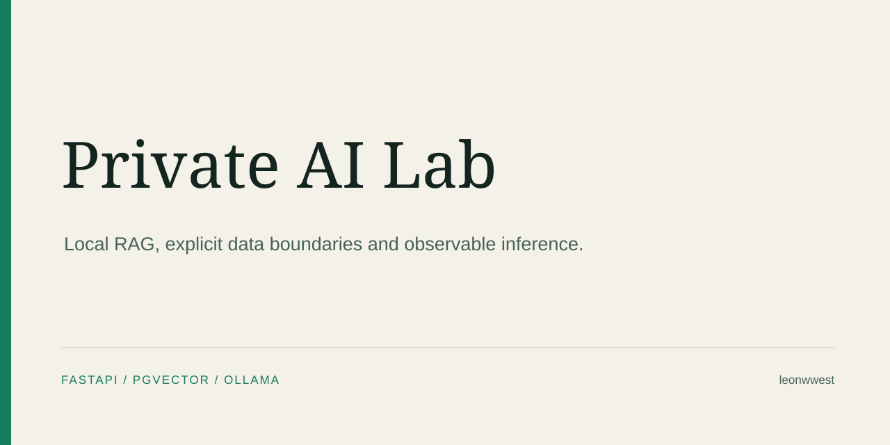
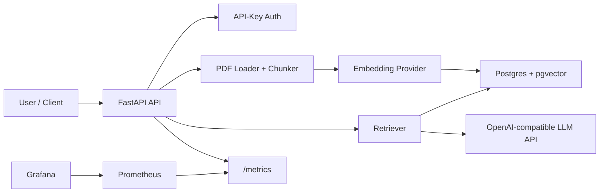

# Private AI Lab



Lokale Private-AI-Plattform als Portfolio-Projekt: FastAPI-App, RAG ueber eigene
PDFs, Postgres mit pgvector, API-Key-Auth, strukturierte Logs, Prometheus-Metrics,
Grafana-Dashboard und Deployment-Artefakte fuer Docker Compose und k3d.

Der Stand ist bewusst zuerst privat gedacht. Das Repo ist aber so aufgebaut, dass
es spaeter mit wenig Nacharbeit oeffentlich gezeigt werden kann.

## CV-Satz

> Private-AI-Plattform lokal aufgebaut mit RAG, API, Observability und
> Deployment-Automation.

## Was das Projekt zeigt

- FastAPI-Service mit Health-, Readiness-, Upload- und Chat-Endpunkten
- PDF-Ingestion mit Textextraktion, Chunking und Vektorablage
- Postgres/pgvector als RAG-Speicher
- OpenAI-kompatibler Chat-Client, lokal z. B. ueber Ollama
- Offline-faehiger Hash-Embedding-Modus fuer Tests und Demo ohne API-Key
- API-Key-Auth ueber `Authorization: Bearer ...` oder `X-API-Key`
- JSON-Logs mit Request-Dauer
- Prometheus-Metrics unter `/metrics`
- Grafana-Provisioning mit einfachem Dashboard
- Docker Compose fuer lokale Plattformtests
- k3d/Kubernetes-Manifeste als Deployment-Demo
- GitHub Actions fuer Lint und Tests
- Non-root Container und Kubernetes `restricted` Pod Security mit getesteten Security Contexts
- Default-deny `NetworkPolicy` mit expliziten API-, Postgres-, DNS- und Ollama-Pfaden
- deterministische Offline-RAG-Evaluation mit synthetischem Datensatz, Top-1-Accuracy und MRR
- guarded PostgreSQL-Backup/Restore-Uebung in einer wegwerfbaren Verifikationsdatenbank

## Architektur



## Lokaler Start ohne Docker

Dieser Modus ist fuer schnelle Code-Tests gedacht. Er nutzt keinen Postgres-Start
und keinen echten LLM-Call.

```bash
cd /Users/leonwestermeir/Projects/private-ai-lab
make venv
make test
INIT_DB_ON_STARTUP=false LLM_BASE_URL=mock .venv/bin/uvicorn app.main:app --reload
```

Healthcheck:

```bash
curl http://localhost:8000/healthz
```

## Start mit Docker Compose

Voraussetzung: Docker ist installiert und laeuft.

```bash
cd /Users/leonwestermeir/Projects/private-ai-lab
cp .env.example .env
docker compose up --build
```

Dienste:

- API: <http://localhost:8000>
- API Docs: <http://localhost:8000/docs>
- Prometheus: <http://localhost:9090>
- Grafana: <http://localhost:3000> (`admin` / `admin`)
- Ollama: <http://localhost:11434>
- Postgres: `localhost:5432`

Ein lokales Modell muss in Ollama vorhanden sein, bevor echte Antworten kommen:

```bash
docker exec -it private-ai-lab-ollama ollama pull llama3.2:3b
```

## Beispiel: PDF hochladen und fragen

```bash
export API_KEY=change-me-before-sharing

curl -X POST http://localhost:8000/v1/documents/upload \
  -H "Authorization: Bearer $API_KEY" \
  -F "file=@/path/to/document.pdf"

curl -X POST http://localhost:8000/v1/chat \
  -H "Authorization: Bearer $API_KEY" \
  -H "Content-Type: application/json" \
  -d '{"question":"Was sind die wichtigsten Punkte im Dokument?","top_k":4}'
```

## Konfiguration

Die wichtigsten Variablen stehen in `.env.example`.

- `API_KEY`: Demo-API-Key, vor echter Nutzung aendern
- `DATABASE_URL`: Postgres/pgvector-Verbindung
- `EMBEDDING_PROVIDER`: `hash` fuer lokale Demo, `openai` fuer echte Embeddings
- `LLM_BASE_URL`: OpenAI-kompatible Chat-API, z. B. Ollama `/v1`
- `LLM_MODEL`: Modellname fuer Chat Completion
- `INIT_DB_ON_STARTUP`: legt Extension und Tabellen beim Start an

## k3d-Demo

Voraussetzungen: Docker, k3d und kubectl.

```bash
make docker-build
make k3d-up
```

Die k3d-Manifeste liegen unter `deploy/k8s/base`. Fuer ein echtes Cluster wuerde
man Secrets, Registry, TLS/Ingress, Persistenz und Monitoring noch haerter
ausarbeiten. Fuer ein Portfolio-Projekt zeigt diese Struktur aber die relevanten
Produktionsbausteine.

## Projektstatus

Die Public-Readiness ist lokal verifiziert: kompletter Git-Verlauf ohne Secret-Fund, 0
High/Critical-Trivy-Befunde, deterministische Tests und synthetische RAG-Evidence. Eine
Sichtbarkeitsaenderung bleibt eine separate bewusste Entscheidung und veroeffentlicht niemals die
lokal ignorierten PDFs, Datenbanken oder `.env`-Dateien.

Vertiefende Nachweise:

- [Architektur](docs/ARCHITECTURE.md)
- [Threat Model und Privacy Boundaries](docs/THREAT_MODEL.md)
- [Offline-RAG-Evaluation](docs/evidence/rag-evaluation.md)
- [Operations](docs/OPERATIONS.md)
- [PostgreSQL Backup und Recovery](docs/POSTGRES_RECOVERY.md)
