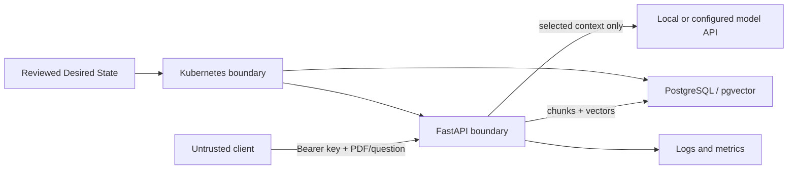

# Threat model and privacy boundaries

## Scope and assumptions

This model covers the local FastAPI, PostgreSQL/pgvector, Ollama-compatible model endpoint and
Kubernetes deployment paths in this repository. It assumes one operator controls the host and
cluster. It does not claim multi-tenant isolation or production compliance.

## Protected assets

- uploaded PDF content and derived chunks
- embeddings, retrieval results and chat context
- API, database and model-provider credentials
- PostgreSQL data and recovery artifacts
- operational logs, metrics and traces
- the integrity of container images and Desired State manifests

## Trust boundaries



The model endpoint is local by default. Configuring a remote OpenAI-compatible endpoint creates a
new data-egress boundary and requires a separate privacy review.

## Threats, controls and residual risk

| Threat | Implemented control and evidence | Residual risk / next control |
|---|---|---|
| Unauthorized upload or chat request | API-key dependency on protected endpoints; tests exercise rejected requests | One shared key has no user-level attribution; production needs identity-aware authorization and rotation |
| Malicious or prompt-injecting PDF | File extension and size checks; LLM system prompt restricts answers to retrieved context | PDFs are not malware-scanned and document instructions can still influence the model; add content scanning and prompt-injection evaluation |
| Accidental document disclosure to a model provider | Hash embeddings and mock LLM support fully offline execution; logs exclude document text | A configured remote model receives selected context; require explicit provider allow-listing and data-processing review |
| Database or backup disclosure | Credentials are externalized from code; example values are synthetic; recovery artifacts are ignored | Local volumes and backup files are not encrypted by this lab; protect the host and use encrypted storage for real data |
| Credential leakage through Git | `.env`, data and reports are ignored; Gitleaks scans complete history; Trivy scans current files | Secret rotation remains an operator responsibility after any suspected exposure |
| Container privilege escalation | Non-root image, restricted Pod Security, dropped capabilities, seccomp and read-only filesystems | Base-image vulnerabilities still require dependency/image refresh and scanning |
| Lateral movement inside the cluster | Default-deny NetworkPolicy with explicit API, PostgreSQL, DNS and Ollama paths | The CNI must enforce NetworkPolicy; the local k3d profile is not a multi-tenant security boundary |
| Supply-chain compromise | SHA-pinned Actions, Dependabot, dependency audit, Trivy and SPDX SBOM workflow | Local verification is authoritative while private Actions are unavailable; signatures and admission verification remain future work |
| Sensitive telemetry | Structured request logs omit PDF bodies and secrets; metrics contain aggregate request data | Request identifiers and timing can still be sensitive when correlated; define retention and access rules for real use |

## Privacy lifecycle

1. The client submits a PDF to the authenticated API.
2. Text is extracted in memory and transformed into chunks and embeddings.
3. PostgreSQL stores document metadata, chunks and vectors.
4. Retrieval sends only selected context blocks to the configured model endpoint.
5. Logs record request metadata, not document bodies, embeddings or credentials.
6. Deletion, retention and legal-hold workflows are outside this lab and must be defined before
   processing real personal or confidential data.

## Public repository boundary

The repository contains synthetic fixtures and example credentials only. Uploaded PDFs, local
databases, `.env` files, reports and recovery artifacts are excluded from Git. Public source code
does not make locally processed documents public.

Before changing visibility or publishing a release, run:

```bash
gitleaks git --no-banner --redact=100 .
make verify
git status --short
```

## Security decisions still required for production

- identity-aware authorization and audit logs
- encrypted, tested backup storage with explicit retention
- upload malware/content scanning and prompt-injection evaluation
- TLS, ingress authentication and rate limits
- approved remote-model providers and data-processing agreements
- signed images and admission verification
